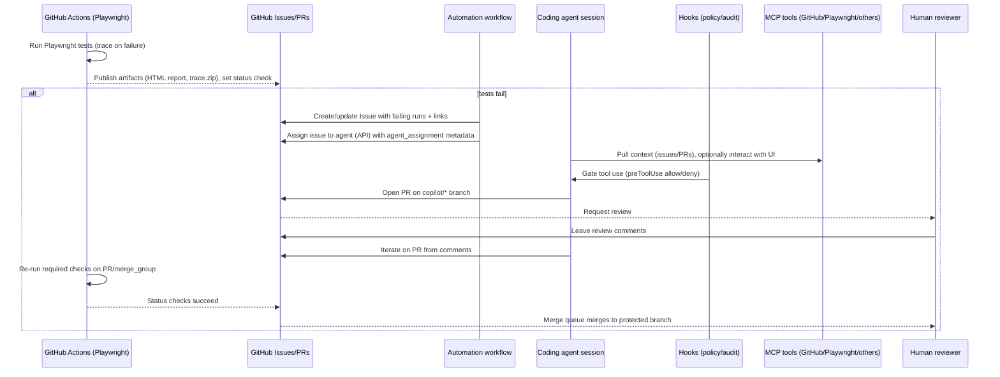

# Enterprise Blueprint for an End-to-End Agentic SDLC with Copilot Agents, Custom Instructions, Skills, MCP, Playwright, Issues, Multi-Engine Orchestration, and PR Gating

## Executive summary

This report provides a slide-ready, end-to-end blueprint for a large company to operationalize agentic software delivery using Copilot agents across the full lifecycle: issue intake → automated triage → implementation via coding agents → verification via Playwright and CI/CD → pull-request automation and review → controlled merge with enterprise guardrails. The approach is optimized for technical engineers and engineering managers who need both a working reference architecture and concrete implementation details (configs, code, workflows, and rollout plan). citeturn20view0turn19view0turn5search0turn7search0

The core “control plane” is GitHub’s agent experience (Agents tab/panel + sessions/logs), where tasks can be delegated asynchronously to coding agents (including third-party agents such as Claude and Codex in public preview) that create PRs and iterate via PR comments. Agent sessions consume GitHub Actions minutes and premium requests, and are observable through session logs. citeturn19view0turn20view0turn8search11turn2view2

Key enterprise levers to make this safe and repeatable are:
- **Repository custom instructions** (repo-wide and path-scoped) to standardize build/test conventions, coding standards, and the definition of done. citeturn3view0turn3view2turn25view2  
- **Agent Skills** (open standard) to encode repeatable “how we do X here” procedures with scripts/resources. citeturn4view1turn4view0turn4view2  
- **MCP servers** (tools-only for the coding agent) to connect agents to external systems (observability, tickets, internal tooling) with explicit allowlisted tools and secret/variable substitution. citeturn27view1turn4view4turn27view0  
- **Hooks** to enforce policy at runtime (approve/deny tool use, log activity, run security validations). citeturn9view0  
- **Branch rules / rulesets / protected branches** to gate merges on required checks (Playwright, security, PR-agent checks) and human approvals, optionally using merge queues at scale. citeturn7search0turn7search1turn7search5  

A pragmatic implementation path is to start with one “golden path” repo template (instructions + Playwright CI + issue forms + agent assignment automation), validate outcomes, then scale via organization/enterprise policies (AI Controls, model access policies, MCP allowlists, usage monitoring). citeturn11search15turn2view2turn2view5turn2view9

## Concepts and definitions

### What “agents” mean in this architecture

**Coding agent (cloud agent)**: An autonomous, asynchronous agent that works in an ephemeral environment (powered by GitHub Actions) to make code changes, run tests/linters, and open PRs. Work is delegated from issues or chat prompts and tracked via session logs. citeturn20view0turn8search11turn26view0

**Third-party coding agents**: Additional coding agents (currently Claude and Codex in public preview) that can be used alongside the default coding agent. They can be started from Agents tab, issues, PR comments via `@AGENT_NAME`, GitHub Mobile, and VS Code; they consume Actions minutes and premium requests per session. citeturn19view0turn10view1turn10view2

**Copilot CLI agent workflows**: Automation where Copilot CLI runs in a terminal or CI to perform tasks (summaries, reviews, scripted changes). In Actions, Copilot CLI requires authenticating a Copilot-licensed user via a token with “Copilot Requests” permission and uses CI-safe options (e.g., `--no-ask-user`). citeturn8search15turn3view2

**PR agent (in this report)**: Any automated reviewer/validator that runs on pull requests and produces outputs used for gating (a check run, a status check, mandated comments, etc.). This includes:
- Copilot code review (comment-only reviews; not merge-blocking by itself) citeturn25view2  
- A custom “PR agent check” implemented as a GitHub Actions status check (merge-blocking via rulesets/branch protection) citeturn7search1turn7search0  

### Customization primitives and where they apply

**Repository custom instructions**:
- Repo-wide instructions live at `.github/copilot-instructions.md` (commonly referenced in GitHub/Copilot docs as the repo-wide location for Copilot surfaces). citeturn3view0turn3view2turn3view3  
- Path-scoped instructions live under `.github/instructions/*.instructions.md` and can include frontmatter `applyTo` with globs to scope the instructions to file sets. citeturn3view0turn3view2  
- Copilot code review reads custom instructions from the **base branch** of the PR, and (notably) reads only the first 4,000 characters of the instruction file for code review use. citeturn25view2  

**Agent Skills (open standard)**:
- A skill is a folder containing a `SKILL.md` plus optional scripts/resources. Skills can be stored in repo under `.github/skills` or `.claude/skills`, or in a user home directory for reuse across projects. citeturn4view0turn4view1  
- The Agent Skills specification is maintained as an open format (maintained by entity["company","Anthropic","ai company"]) with documentation and SDK references. citeturn4view2turn4view1  

**MCP (Model Context Protocol)**:
- MCP is an open standard for connecting models/agents to tools and data sources; in GitHub’s coding agent, MCP is used specifically to extend the agent’s tool capabilities. citeturn4view4turn27view1turn0search11  
- For the coding agent specifically: only **tools** are supported (not MCP resources/prompts), and remote MCP servers using OAuth are not supported “currently” (per docs). citeturn27view1turn4view4  
- Once configured, the agent can use MCP tools autonomously and will not ask approval before tool use—meaning allowlisting tools and restricting secrets exposure is critical. citeturn27view1turn4view3  

**Hooks**:
- Hooks are JSON-configured commands that run at defined lifecycle points (sessionStart, preToolUse, postToolUse, errorOccurred, etc.) and can approve/deny tool executions and implement audit logging/compliance controls. Hooks are stored at `.github/hooks/*.json`. citeturn9view0  

**Playwright (two distinct roles)**:
1) As a test framework (Playwright Test) used in CI to validate UI flows across browsers/devices, generate traces, and publish reports. citeturn5search10turn5search0turn5search17  
2) As an MCP server available to the coding agent by default, enabling the agent to read/interact with web pages and take screenshots (within constraints such as localhost-only by default in the agent environment). citeturn4view4  

### Comparison tables for slides

**Agent types and operational trade-offs**

| Agent / capability | Where it runs | Primary interfaces | Strengths | Key trade-offs / risks |
|---|---|---|---|---|
| Coding agent | GitHub Actions-powered ephemeral environment | Issues → PRs; Agents panel/tab; PR comments (`@copilot`) | Asynchronous end-to-end PR creation; session logs; integrates with instructions, MCP, hooks | Workflows aren’t auto-run by default; tool autonomy requires strict guardrails; limited to repo/task scope; one PR per task citeturn20view0turn24view1turn27view1 |
| Third-party coding agents | GitHub-integrated agent sessions | Agents tab; issues; PR comments (`@AGENT_NAME`) | Multi-agent comparison and specialization (e.g., reasoning styles) | Public preview; costs in premium requests + Actions minutes; requires explicit enablement citeturn19view0turn10view1turn10view2 |
| Copilot code review | Service-backed review + tools | GitHub.com, Mobile, IDEs | Fast review feedback; suggested changes; can be auto-requested via rulesets | Leaves “Comment” only (no Approve/Request changes); doesn’t block merges alone; excluded file types; instruction size limit for reviews citeturn25view2turn25view0turn25view1 |
| Copilot CLI automation | CI runner or developer machine | Terminal; GitHub Actions | Automates summaries, scripted tasks, PR checks; can write workflow summaries | Requires licensed user token with Copilot Requests permission; must constrain allowed tools for safety citeturn8search15turn3view2 |

**Model/engine selection inside the platform**

GitHub supports multiple models with multipliers (premium request consumption), and both agent sessions and chat can be multi-model. In particular, the coding agent model picker includes Claude variants and GPT-5.* Codex models in supported entry points. citeturn10view4turn10view5turn2view2

| Model / strategy | Where it’s chosen | Why you’d use it | Enterprise consideration |
|---|---|---|---|
| Explicit model selection | When assigning issues / starting agent tasks in supported entry points | Match model strengths to task type; consistency for regulated code paths | Requires policy alignment and quota awareness; choice may be limited by plan/policies citeturn10view4turn11search16 |
| Auto model selection | Chat + (some) coding agent contexts | Reduces rate limiting, latency/errors, and mental load; excludes models with multiplier >1 | Admin policies constrain the eligible models; discount applies for paid plans in Chat citeturn12view0turn11search16 |
| Multi-agent comparison | Agent HQ (multiple agents per task) | Parallelize approaches, compare trade-offs and outputs | Higher premium usage; requires clear selection criteria and evaluation rubrics citeturn10view2turn10view3 |

Note: For vendor context, GitHub’s agent ecosystem is part of entity["company","Microsoft","technology company"]’s broader developer tooling stack. citeturn10view1turn10view2

## Reference architecture and diagrams

### High-level architecture

```mermaid
flowchart TB
  Dev[Developer / Team] -->|opens/edits| Issue[GitHub Issue]
  Issue -->|assignment (UI/API)| AgentHQ[Agents control plane\n(Agents tab/panel, sessions)]
  AgentHQ --> AgentSession[Agent session\n(Copilot / third-party)]
  AgentSession --> Env[Ephemeral dev environment\n(GitHub Actions-powered)]
  Env --> Repo[Repository checkout + edits]
  Env --> Tests[Build + unit tests + Playwright E2E]
  Env --> MCP[MCP tools\n(GitHub data, Playwright MCP,\nexternal systems)]
  Env --> Hooks[Hooks: preToolUse/postToolUse\npolicy & audit]
  Repo --> PR[Pull Request\n(copilot/* branch)]
  PR --> Review[Human review + Copilot code review]
  PR --> CI[CI required checks\n(status checks)]
  CI -->|pass| Merge[Merge queue / protected branch]
  CI -->|fail| Triage[Auto issue update + reassign to agent]
  Triage --> Issue
```

This architecture matches documented behavior: agents execute in an ephemeral Actions-based environment, create PRs, and can be invoked from issues/Agents tab/PR comments; session logs provide transparency; hooks and MCP extend/guard the agent. citeturn20view0turn19view0turn9view0turn27view1turn8search11

### Sequence: Playwright failure → Issue → agent triage → PR → gating



The flow relies on (a) Playwright CI patterns and trace debugging, and (b) the ability to assign issues to the coding agent via API and have it open PRs for review, and (c) branch protection/rulesets requiring status checks. citeturn5search0turn5search1turn16view1turn7search1turn7search5

image_group{"layout":"carousel","aspect_ratio":"16:9","query":["GitHub Agents panel Copilot coding agent session log screenshot","Playwright trace viewer screenshot","GitHub Actions Playwright workflow report artifacts screenshot"],"num_per_query":1}

### Multi-engine orchestration pattern for large companies

```mermaid
flowchart LR
  Task[One task / issue] --> Split{Orchestrate?}

  Split -->|Single-agent| A1[Copilot coding agent\n(model: Auto or selected)]
  Split -->|Parallel agents| P[Run multiple sessions\nCopilot + Claude + Codex]
  Split -->|Cascade| C[Start small/fast model\nescalate on uncertainty]

  P --> Eval[Evaluate outputs\n(test pass, diff risk, complexity)]
  C --> Escalate{Need deeper reasoning?}
  Escalate -->|yes| Big[Higher capability model/session]
  Escalate -->|no| Done[Proceed]

  A1 --> PR1[PR]
  Big --> PR2[PR]
  Eval --> PRselect[Select best PR or cherry-pick]
  PRselect --> Gate[Required checks + human approval]
```

This diagram reflects: (1) platform support for multi-agent sessions and comparing outputs, and (2) model selection and auto model selection behaviors (system-health/performance driven, policy constrained). citeturn10view2turn12view0turn10view4turn10view1

## Setup and configuration guide

This section is designed as “speaker notes + copy/paste artifacts.” Where possible, it uses doc-backed defaults and highlights enterprise-sensitive controls (permissions, secrets, and workflow safety).

### Baseline repository structure

```text
repo/
  .github/
    copilot-instructions.md
    instructions/
      frontend.instructions.md
      testing.instructions.md
    skills/
      playwright-triage/
        SKILL.md
        scripts/
          reproduce.sh
          summarize-trace.ts
    hooks/
      policy-and-audit.json
    workflows/
      copilot-setup-steps.yml
      playwright.yml
      triage-playwright-failures.yml
      assign-issue-to-agent.yml
      pr-agent-check.yml
    ISSUE_TEMPLATE/
      config.yml
      bug.yml
      flaky-test.yml
```

The file locations align with GitHub’s repository custom instruction formats and the hook/skill storage paths. citeturn3view0turn3view2turn4view0turn9view0

### Enablement and policy prerequisites

For large companies, the critical setup step is enabling agents (and partner agents) at the enterprise/org level, then controlling availability and policies via AI Controls. Partner agents (Claude and Codex) require explicit enablement and are included in Copilot subscriptions during public preview, with each session consuming a premium request. citeturn10view1turn19view0turn11search15

If you plan to use auto model selection, remember it selects models based on real-time system health/performance and excludes models with multiplier >1; admin policies also constrain which models are eligible. citeturn12view0turn11search16

### Authoring repository custom instructions

**Repository-wide instructions** (recommended: keep short, operational, and test-focused):

```md
<!-- .github/copilot-instructions.md -->

# Repository context
- This repo contains a web UI + API.
- Preferred package manager: npm (lockfile must be updated on dependency changes).
- Source of truth for UI selectors: data-testid attributes in the UI layer.

# Definition of done for any PR
- Include unit tests and Playwright E2E coverage for user-visible behavior.
- Add/Update documentation for any new CLI flag or config field.
- Run: npm ci && npm test && npx playwright test
- Provide a short PR description explaining risk, rollout, and monitoring.

# Coding standards
- Prefer small functions; validate inputs.
- Avoid introducing new dependencies unless required.
- Never add secrets to code. Use environment variables or secret stores.
```

Repository-wide and path-specific instruction file types are explicitly supported, with path-scoped instruction files under `.github/instructions/*.instructions.md` supporting `applyTo` frontmatter patterns. citeturn3view0turn3view2

**Path-specific instructions** (example: only for Playwright tests):

```md
---
applyTo: "tests/e2e/**/*.spec.ts"
---
# Playwright conventions
- Use role-based locators (getByRole/getByLabel) where possible.
- Every new UI button must have an accessibility name and, where appropriate, a stable data-testid.
- For flaky tests: add trace-on-first-retry and capture screenshots on failure.
```

The `applyTo` frontmatter approach and glob syntax are documented for path-specific instructions. citeturn3view2

**Important for PR review workflows**: Copilot code review reads only the first 4,000 characters of any custom instruction file and uses the custom instructions from the base branch of the PR. Design instructions accordingly (short “review rules,” link out to longer docs). citeturn25view2

### Creating Agent Skills

Agent Skills are a folder format (open standard) that Copilot can load when relevant. A skill is defined by `SKILL.md` with required YAML frontmatter fields such as `name` and `description`. Skills can live in `.github/skills` (project skills) or `~/.copilot/skills` (personal skills). citeturn4view0turn4view1turn4view2

**Example skill: “playwright-triage”**

```md
---
name: playwright-triage
description: >
  Use when Playwright E2E tests fail. Reproduce failures locally/CI,
  extract trace insights, and create a concrete fix + regression test.
license: "Internal"
---

## When to use
- A Playwright workflow failed on a PR or merge_group run.
- The failure includes a trace.zip and/or HTML report artifact.

## Inputs you should request or locate
- The failing test name(s), project/browser, and run URL.
- Links to trace.zip and report.
- Recent UI change commits.

## Procedure
1) Reproduce:
   - Install deps and browsers
   - Run only the failing test with retries disabled
2) Diagnose:
   - Use trace viewer data: action timeline, DOM snapshots, console/network
3) Fix:
   - Prefer user-visible assertions and stable locators
4) Prevent regressions:
   - Add a test case capturing the bug class
5) Provide output:
   - Update the issue with root cause + fix summary
   - Ensure CI green

## Optional scripts
- scripts/reproduce.sh: runs the correct Playwright command
- scripts/summarize-trace.ts: produces a Markdown summary for the issue
```

This structure follows GitHub’s documented skill creation process and required fields. citeturn4view0turn4view1

### Configuring the agent development environment

Copilot coding agent runs in an ephemeral GitHub Actions-powered development environment and can run tests/linters. You can “front-load” dependencies and tooling via a special workflow file `.github/workflows/copilot-setup-steps.yml` that must contain exactly one job named `copilot-setup-steps`. citeturn26view0turn20view0

**Example `copilot-setup-steps.yml`**

```yaml
name: "Copilot Setup Steps"
on:
  workflow_dispatch:
  push:
    paths: [ .github/workflows/copilot-setup-steps.yml ]

jobs:
  copilot-setup-steps:
    runs-on: ubuntu-latest
    permissions:
      contents: read
    steps:
      - uses: actions/checkout@v5
      - uses: actions/setup-node@v5
        with:
          node-version: lts/*
      - run: npm ci
      - run: npx playwright install --with-deps
```

This file path, job naming requirement, and the “lowest permissions possible” guidance are explicitly documented; setup step failures cause remaining steps to be skipped with the agent proceeding in whatever environment state exists (a key failure mode to plan for). citeturn26view0turn6search3

### MCP configuration for the coding agent

MCP servers are configured for a repository via JSON added in repository settings (Copilot → Coding agent → MCP configuration). The JSON must contain an `mcpServers` object; servers have a `type` and a `tools` allowlist; local servers define `command`, `args`, and optional `env`; remote servers define `url` and optional `headers`. Secret/variable substitution is supported, but referenced names must start with `COPILOT_MCP_`. citeturn27view1turn4view3

**Example MCP config (local server; allowlist read-only tools)**

```json
{
  "mcpServers": {
    "sentry": {
      "type": "local",
      "command": "npx",
      "args": ["@sentry/mcp-server@latest", "--host=$SENTRY_HOST"],
      "tools": ["get_issue_details", "get_issue_summary"],
      "env": {
        "SENTRY_HOST": "https://example.sentry.io",
        "SENTRY_ACCESS_TOKEN": "$COPILOT_MCP_SENTRY_ACCESS_TOKEN"
      }
    }
  }
}
```

The schema and the example pattern (including allowlisting tools and env substitution) are mirrored from GitHub’s MCP configuration docs. citeturn27view0turn27view1

**Critical security properties to communicate on slides**:
- The coding agent will be able to use MCP tools autonomously and will not ask approval first. citeturn27view1turn4view3  
- The coding agent supports MCP **tools only** (not resources/prompts), and does not currently support remote MCP servers that use OAuth; plan authentication strategies accordingly. citeturn27view1turn4view4  

Also note that the coding agent is preconfigured with default MCP servers including GitHub (read-only scoped token by default) and a Playwright MCP server for interacting with web pages in the agent environment (localhost-restricted by default). citeturn4view4turn20view0

### Hooks for policy enforcement and audit logging

Hooks are configured as JSON and stored in `.github/hooks/*.json`. They can run commands at lifecycle points such as `preToolUse` (approve/deny tool executions) and `postToolUse` (log outcomes). Hooks receive JSON input describing agent actions and run synchronously (so keep them fast). citeturn9view0

**Example: `policy-and-audit.json`**

```json
{
  "version": 1,
  "hooks": {
    "preToolUse": [
      {
        "type": "command",
        "bash": "./scripts/agent-policy-check.sh",
        "cwd": "scripts",
        "timeoutSec": 15
      }
    ],
    "postToolUse": [
      {
        "type": "command",
        "bash": "cat >> logs/agent-tool-events.jsonl",
        "timeoutSec": 5
      }
    ],
    "errorOccurred": [
      {
        "type": "command",
        "bash": "./scripts/notify-on-error.sh",
        "cwd": "scripts",
        "timeoutSec": 10
      }
    ]
  }
}
```

This aligns with GitHub’s hook configuration format (version, hooks map, command type, OS-specific commands, timeouts) and the documented governance use cases (deny dangerous tools, run secret scanning, implement audit logging). citeturn9view0

## End-to-end workflows and concrete examples

### Playwright CI/CD integration with required checks

Playwright provides a documented GitHub Actions workflow template (often generated during setup) that runs on push and pull requests and installs browsers. citeturn5search0

For enterprise-grade gating, update triggers to include `merge_group` when using merge queues, because required checks must run for merge queue temporary branches; GitHub explicitly warns merges will fail if required checks aren’t reported for `merge_group`. citeturn7search5turn7search13

**Sample `.github/workflows/playwright.yml` (CI-grade)**

```yaml
name: E2E - Playwright

on:
  pull_request:
    branches: [ main ]
  merge_group:
  workflow_dispatch:

jobs:
  e2e:
    timeout-minutes: 60
    runs-on: ubuntu-latest
    permissions:
      contents: read

    steps:
      - uses: actions/checkout@v5
      - uses: actions/setup-node@v5
        with:
          node-version: lts/*

      - name: Install deps
        run: npm ci

      - name: Install Playwright browsers
        run: npx playwright install --with-deps

      - name: Run E2E
        run: npx playwright test

      - name: Upload Playwright report
        if: always()
        uses: actions/upload-artifact@v4
        with:
          name: playwright-report
          path: playwright-report/

      - name: Upload traces (if any)
        if: always()
        uses: actions/upload-artifact@v4
        with:
          name: playwright-traces
          path: test-results/**/trace.zip
```

Playwright’s CI docs cover workflow setup and emphasize viewing logs, HTML reports, and traces. citeturn5search0turn5search17

**Playwright config patterns that unlock high-quality triage**
- Record traces on first retry and use CI retries selectively. citeturn5search1turn5search5  
- Use conservative workers for CI stability (often `workers: 1`), then shard only when you have stable suites and sufficient system capacity. citeturn5search4turn5search11  
- Use resilient assertions and automatic waiting, focusing on user-visible behavior. citeturn5search18turn5search8turn5search15  

### Automation: create/update GitHub Issues on failed Playwright runs

GitHub documents using `GITHUB_TOKEN` for authenticated API calls in workflows, including creating issues via REST API. citeturn6search2  
Security guidance is to grant the minimum permissions and, ideally, default `GITHUB_TOKEN` to read-only and elevate per job. citeturn6search3turn6search11

**Sample `.github/workflows/triage-playwright-failures.yml`**

```yaml
name: Triage Playwright failures

on:
  workflow_run:
    workflows: ["E2E - Playwright"]
    types: [completed]

jobs:
  issue-on-failure:
    if: ${{ github.event.workflow_run.conclusion == 'failure' }}
    runs-on: ubuntu-latest
    permissions:
      issues: write
      actions: read
      contents: read

    steps:
      - name: Create or update a failure issue
        uses: actions/github-script@v7
        with:
          script: |
            const run = context.payload.workflow_run;
            const title = `[E2E Failure] ${run.name} #${run.run_number}`;
            const body = [
              `Workflow: ${run.html_url}`,
              `Conclusion: ${run.conclusion}`,
              `Commit: ${run.head_sha}`,
              `Branch: ${run.head_branch}`,
              ``,
              `Next step: assign this issue to the coding agent with the Playwright triage skill.`
            ].join("\n");

            await github.rest.issues.create({
              owner: context.repo.owner,
              repo: context.repo.repo,
              title,
              body,
              labels: ["e2e", "playwright", "ci-failure"]
            });
```

This leverages GitHub’s documented pattern for REST API calls using `GITHUB_TOKEN`, while keeping permissions explicit and minimal. citeturn6search2turn6search3turn7search10

### Automation: assign the issue to the coding agent (API-driven)

GitHub explicitly documents assigning issues to the coding agent via REST API, including an `agent_assignment` object that can specify `target_repo`, `base_branch`, `custom_instructions`, `custom_agent`, and `model`. The documented REST examples use `assignees: ["copilot-swe-agent[bot]"]`. citeturn16view1turn16view0

The same doc states you should authenticate using a **user token** (e.g., a fine-grained PAT or “GitHub App user-to-server token”), and details required permissions for fine-grained PATs (read metadata; read/write actions, contents, issues, pull requests). citeturn16view0turn16view1

**Sample `.github/workflows/assign-issue-to-agent.yml`**

```yaml
name: Assign issue to coding agent (on label)

on:
  issues:
    types: [labeled]

jobs:
  assign:
    if: ${{ github.event.label.name == 'ready-for-agent' }}
    runs-on: ubuntu-latest
    permissions:
      contents: read

    steps:
      - uses: cli/cli@v2
      - name: Assign issue via REST API to coding agent
        env:
          GH_TOKEN: ${{ secrets.COPILOT_ASSIGNMENT_PAT }}
          OWNER: ${{ github.repository_owner }}
          REPO: ${{ github.event.repository.name }}
          ISSUE_NUMBER: ${{ github.event.issue.number }}
        run: |
          gh api \
            --method POST \
            -H "Accept: application/vnd.github+json" \
            /repos/$OWNER/$REPO/issues/$ISSUE_NUMBER/assignees \
            --input - <<'JSON'
          {
            "assignees": ["copilot-swe-agent[bot]"],
            "agent_assignment": {
              "target_repo": "'"$OWNER/$REPO"'",
              "base_branch": "main",
              "custom_instructions": "Use the playwright-triage skill. Fix the failing test and add regression coverage.",
              "custom_agent": "",
              "model": "Auto"
            }
          }
          JSON
```

This is a direct implementation of the documented REST approach and `agent_assignment` fields. citeturn16view1turn16view0

### Multi-engine patterns for orchestration in practice

For presentations, it’s useful to distinguish “multi-engine” in two ways:

1) **Multi-agent selection (Copilot vs Claude vs Codex)**: GitHub documents third-party agents (Claude and Codex) and provides an Agent HQ experience to run agents from multiple providers while keeping context/history/review attached. citeturn19view0turn10view2

2) **Model selection within Copilot experiences**: The coding agent’s supported model picker includes Claude Sonnet/Opus variants and GPT-5.* Codex models, and you can select Auto where available. citeturn10view4turn12view0

**Recommended orchestration playbook (enterprise-friendly)**
- Use **parallel agents** only for high-impact work where comparing trade-offs is valuable (e.g., risky refactors, security fixes). GitHub explicitly positions Agent HQ as enabling comparison and parallel sessions. citeturn10view2turn10view3  
- Use **cascade escalation** for cost control: start with Auto or a lower-multiplier model, then escalate when tests fail repeatedly or the agent expresses uncertainty. Multipliers and premium request semantics are documented. citeturn2view2turn10view5turn12view0  
- Use **specialization via custom instructions + skills** as the default scaling mechanism; it improves consistency without paying the coordination overhead of multiple agents. citeturn4view1turn20view0turn8search17  

### PR gating with rulesets, required checks, and PR agents

**Protected branches / rulesets**: GitHub branch protection rules and rulesets can require approving reviews and/or passing status checks before merging. Required status checks ensure all required checks pass before merges. citeturn7search0turn7search1turn7search4

**Merge queue (optional)**: Merge queues validate PR changes against the latest base branch + queued changes using `merge_group`; CI must trigger on `merge_group` or merges fail due to missing required checks. citeturn7search5turn7search13

**Copilot code review**: Copilot code review leaves a “Comment” review only; it does not count toward required approvals and does not block merging by itself. Therefore, treat it as informative signal, not a gate. citeturn25view2

**How to enable automatic Copilot code review via rulesets**: GitHub documents a repository ruleset option “Automatically request Copilot code review” and an optional “Review new pushes” setting. citeturn25view1

**A merge-blocking PR agent check (Actions-based)**  
Because Copilot code review doesn’t merge-block, implement a merge-blocking “PR agent check” as a required status check. GitHub rulesets/branch protection can then require this check to pass. citeturn7search1turn7search0

Below is a pragmatic pattern using Copilot CLI programmatically (documented for Actions automation), producing a pass/fail exit code based on structured output. citeturn8search15

```yaml
name: PR Agent Check

on:
  pull_request:
    branches: [ main ]
  merge_group:

jobs:
  pr-agent-check:
    runs-on: ubuntu-latest
    permissions:
      contents: read
      pull-requests: read

    steps:
      - uses: actions/checkout@v5

      - name: Install Copilot CLI
        run: |
          # installation method depends on your package manager / runner image
          # (keep this aligned with your enterprise standards)

      - name: Run PR agent review (structured)
        env:
          COPILOT_GITHUB_TOKEN: ${{ secrets.COPILOT_CLI_PAT }}
        run: |
          copilot -p "
          Review this diff and output STRICT JSON:
          {
            \"risk\": \"low|medium|high\",
            \"must_fix\": [\"...\"] ,
            \"recommendations\": [\"...\"] ,
            \"tests_needed\": [\"...\"] ,
            \"security_notes\": [\"...\"] 
          }
          Focus on correctness, security, and maintainability.
          " --no-ask-user > pr_agent_output.json

          node -e "
          const fs = require('fs');
          const o = JSON.parse(fs.readFileSync('pr_agent_output.json','utf8'));
          if (o.risk === 'high' || (o.must_fix && o.must_fix.length)) process.exit(1);
          "
```

The key doc-backed elements here are: (1) authenticating Copilot CLI in Actions using a token with Copilot Requests permission and `COPILOT_GITHUB_TOKEN`, and (2) running the CLI programmatically with `--no-ask-user` for non-interactive CI. citeturn8search15turn3view2

### Sample Playwright test matrix “covering every UI button/feature”

Because your target application is unspecified, the following is a **template matrix** suitable for a typical enterprise web app (admin portal + end-user UI). It aims for “complete button/feature coverage” by forcing you to inventory every interactive control per page and define standard test cases per control type.

**Dimension A: UI inventory (every interactive element must map to at least one test)**

| Page / feature area | UI control inventory (examples) | Minimum test cases per control |
|---|---|---|
| Auth | Sign in, SSO button, forgot password, show/hide password, MFA submit | happy path; invalid creds; rate limiting UX; a11y name/role; keyboard-only flow |
| Global nav | Sidebar expand/collapse, each nav link, search, profile menu | each link navigates; active state; keyboard navigation; permission-based visibility |
| Data tables | Sort, filter, column chooser, pagination, row actions (view/edit/delete) | sort correctness; filter correctness; pagination stability; destructive action confirm modal |
| Forms | Save/Cancel, inline validation, dropdowns, file upload | validation messages; required fields; submit success/failure; persisted state; file type restriction |
| Modals & drawers | Open/close buttons, overlay click, ESC behavior | open by button; close by X/ESC; focus trap; no background interaction |
| Notifications | Toast dismiss, error banners, retry buttons | appears on action; dismiss; retry triggers correct call; does not leak sensitive info |
| Settings | Feature toggles, API key rotate button, integrations enable/disable | toggles persist; privilege checks; audit banner; revoke/rotate flows |
| Reports | Export CSV/PDF, date range picker, share link button | export completes; file contents sanity; loading states; access control |
| Accessibility controls | Skip link, high-contrast toggle (if any) | focus order; screen reader landmarks; contrast snapshots (if part of app) |

This matrix aligns with Playwright’s emphasis on testing user-visible behavior (not internal implementation details) and on robust waiting/assertions rather than brittle timings. citeturn5search8turn5search18turn5search15

**Dimension B: environment/browser/device matrix**

Playwright supports Chromium, WebKit, and Firefox with mobile emulation; use projects to define coverage. citeturn5search10turn5search6turn5search13

| Project | Browser/device | Why it exists | Typical tag |
|---|---|---|---|
| Desktop Chromium | Chromium + desktop viewport | primary dev/test target for most teams | `@smoke`, `@regression` |
| Desktop Firefox | Firefox | engine variance (layout, standards) | `@regression` |
| Desktop WebKit | WebKit | proxies Safari behavior | `@regression` |
| Mobile emulation | iPhone-class device emulation | responsive UI + touch | `@smoke-mobile` |

Playwright supports test tagging and projects, which helps you implement “all buttons covered” without running the entire matrix on every commit. citeturn5search12turn5search13

### Sample Issue templates and automation rules

GitHub supports both issue templates and YAML issue forms, stored under `.github/ISSUE_TEMPLATE`. You can customize the template chooser via `.github/ISSUE_TEMPLATE/config.yml`. citeturn6search1turn6search0turn6search6

**`.github/ISSUE_TEMPLATE/config.yml`**

```yaml
blank_issues_enabled: false
contact_links:
  - name: Security issue
    url: https://example.com/security
    about: Report security vulnerabilities via the security process.
  - name: Support
    url: https://example.com/support
    about: General support requests.
```

Issue template chooser configuration and `blank_issues_enabled` behavior are documented. citeturn6search1

**Example issue form: `.github/ISSUE_TEMPLATE/bug.yml`**

```yaml
name: Bug report
description: Report a bug with reproduction steps and expected behavior.
title: "[Bug]: "
labels: ["bug", "needs-triage"]
body:
  - type: textarea
    id: summary
    attributes:
      label: Summary
      description: What broke and why it matters.
    validations:
      required: true

  - type: textarea
    id: repro
    attributes:
      label: Reproduction steps
      description: Minimal steps, include environment details.
    validations:
      required: true

  - type: dropdown
    id: area
    attributes:
      label: Area
      options:
        - UI
        - API
        - CI
        - Docs
    validations:
      required: true

  - type: textarea
    id: logs
    attributes:
      label: Logs / screenshots / trace links
      description: Link to Playwright trace artifacts, CI runs, screenshots.
```

Issue form syntax and YAML-based schema are documented. citeturn6search0turn6search4

**Automation rule (example)**: label-driven assignment to agent (as shown earlier) is triggered by the `issues` event; webhook/events for issues and workflow triggers are documented. citeturn7search18turn7search10

## Governance, security, observability, failure modes, and best practices

### Security and permissions model

**Baseline risk model**: An autonomous agent can push code changes; GitHub mitigations include restricting who can trigger the coding agent (write access only), restricting pushes to branches beginning with `copilot/`, restricting workflow runs by default until human approval, and requiring independent human approvals (the requester can’t approve). citeturn20view0turn8search2turn24view1

**Workflow execution safety (high-impact setting)**:
- By default, Actions workflows don’t run automatically when the coding agent pushes changes; a human must click “Approve and run workflows.” citeturn24view1turn22view0  
- GitHub introduced a repository setting to skip human approval (workflows run immediately), explicitly warning this can expose secrets or grant write access to unreviewed code. citeturn22view0turn24view1  

**Practical guidance for enterprises**:
- Keep default workflow approval on for repos that contain privileged workflows (deployment, security admin, token write access). Use environment protections and approvals for particularly sensitive workflows. citeturn22view0turn6search3  
- Apply the principle of least privilege to `GITHUB_TOKEN`: set default to read-only and elevate per workflow/job as needed. citeturn6search3turn6search11  
- When assigning issues to the agent via API from CI, use a fine-grained PAT stored as a secret with only the documented required permissions, and prefer user-to-server tokens where appropriate. citeturn16view0turn6search25  

**MCP-specific risks**:
- Because MCP tools can be invoked autonomously, always allowlist only the tools needed and prefer read-only tools. citeturn27view1turn4view3  
- Use `COPILOT_MCP_*` secrets/variables for substitution and keep secrets scoped in the “copilot” environment, as documented. citeturn27view1turn27view0  

**Prompt injection and untrusted content**:
- GitHub explicitly calls out prompt injection as a risk and applies mitigations (e.g., filtering hidden characters) while limiting who can influence agent prompts (write access only). citeturn20view0  
- Tie this to your secure SDLC training and standards from entity["organization","OWASP","web security foundation"] (GenAI guidance is referenced by GitHub in this context). citeturn20view0  

### Observability and logging

**Agent session logs**:
- Session logs expose what the agent did and (per docs) its “internal monologue” and tools used, and show setup steps execution; they are central for debugging and governance audits. citeturn8search11turn26view0turn1view0  
- Managing agents includes monitoring session logs and redirecting agents; GitHub provides an Agents task management surface (Agents tab/panel). citeturn11search4turn1search9  

**Hooks-based audit trails**:
- Hooks provide a structured approach to log prompts, tool usage, execution results, and errors to JSONL; they can feed centralized logging (e.g., upload as workflow artifacts or ship to internal log systems). citeturn9view0  

**Playwright artifacts and privacy**:
- Playwright traces are designed for CI debugging; the Trace Viewer can open traces locally or in-browser, and the hosted trace viewer loads traces entirely in the browser without transmitting data externally (useful to communicate privacy posture). citeturn5search17  

**Cost/usage observability**:
- Copilot usage involves premium requests; premium models have multipliers; auto model selection can reduce rate limiting and includes constraints on which models are included. citeturn2view2turn10view5turn12view0  
- For large organizations, operational dashboards should incorporate premium request usage tracking and adoption (GitHub provides usage monitoring docs and concepts). citeturn2view9turn11search10turn20view0  

### Failure modes and mitigations

**Failure mode: instructions not applied / too long**
- Symptom: inconsistent output, missing standards, poor code review relevance.
- Mitigation: enforce `.github/copilot-instructions.md` presence and keep “review-critical” rules within first 4k chars for code review; use path-specific instructions for noisy areas. citeturn25view2turn3view0turn3view2  

**Failure mode: workflows not running on agent PRs**
- Symptom: PR created but required checks missing; developers must manually approve.
- Mitigation: train reviewers on “Approve and run workflows,” or enable the repository setting to skip approval only for low-risk repos; explicitly warn about `.github/workflows/` changes. citeturn24view1turn22view0  

**Failure mode: MCP server misconfig or missing dependencies**
- Symptom: MCP tools unavailable; agent can’t complete external tool steps.
- Mitigation: validate MCP configuration via session logs (“Start MCP Servers” step), install dependencies via `copilot-setup-steps.yml`, and restrict to allowlisted tools. citeturn27view1turn26view0turn4view3  

**Failure mode: Setup steps fail**
- Symptom: environment incomplete; agent acts without expected deps.
- Mitigation: keep setup steps minimal and robust; fail fast; monitor session logs; note that if a setup step exits non-zero, remaining steps are skipped and agent proceeds. citeturn26view0turn8search11  

**Failure mode: flaky Playwright tests**
- Symptom: intermittent failures, reduced trust in gating.
- Mitigation: use retries with trace-on-first-retry, rely on robust assertions with auto-waiting, and prioritize stability guidelines for CI execution. citeturn5search1turn5search5turn5search15turn5search4  

**Failure mode: merge queue missing checks**
- Symptom: merge queue stalls/fails with missing required checks.
- Mitigation: trigger workflows on `merge_group` and ensure required checks are configured for merge queue branches. citeturn7search5turn7search13  

### Best practices for large-company rollout

**Engineering process best practices**
- Treat issue assignment as prompt design: write issues so an agent can implement them deterministically (acceptance criteria, test expectations, constraints). citeturn13search10turn20view0  
- Standardize gating: require tests/security checks via rulesets, and require at least one independent human approval; Copilot code review is informative but not merge-blocking. citeturn7search1turn25view2turn20view0  
- Use merge queues on high-volume branches; ensure `merge_group` triggers exist. citeturn7search5turn7search13  

**Platform governance best practices**
- Use AI Controls and enterprise policies to manage agents, models, and MCP usage. citeturn11search15turn10view1turn27view1  
- For MCP: prefer “read-only tools first,” strict allowlists, and secrets only via `COPILOT_MCP_*` environment variables. citeturn27view1turn4view3  
- Use hooks to enforce “no dangerous commands,” prevent logging sensitive data, and build audit trails. citeturn9view0  

### Suggested implementation timeline

This is an **example** timeline for a large enterprise adopting this pattern across multiple teams. Adjust for your SDLC maturity, compliance needs, and existing CI health.

**Phase 1: Foundation (Weeks 1–2)**  
Establish AI Controls and policies; pick pilot repos; define required checks (Playwright, unit, lint, security) and branch protections/rulesets.

**Phase 2: Golden-path repo template (Weeks 2–4)**  
Add `.github/copilot-instructions.md`, `.github/instructions/*.instructions.md`, initial issue forms, Playwright CI with trace artifacts, and a basic failure-to-issue workflow.

**Phase 3: Agent operationalization (Weeks 4–6)**  
Add skill packs (Playwright triage, dependency updates, documentation updates); add `copilot-setup-steps.yml`; add hooks for policy/audit; pilot MCP connections (read-only first).

**Phase 4: Multi-engine orchestration (Weeks 6–8)**  
Enable third-party agents where appropriate; define orchestration patterns (parallel vs cascade); define evaluation rubrics; monitor premium request usage/multipliers.

**Phase 5: Scale-out (Weeks 8–12)**  
Roll templates org-wide; add training; refine PR-agent check gating; implement observability dashboards (session logs, CI stability, PR throughput, premium usage).

This rollout sequence is consistent with GitHub’s documented emphasis on customizing agent environments, instructions, skills, MCP integrations, and governance controls (policies, session logs, usage monitoring). citeturn20view0turn26view0turn9view0turn2view9turn11search15